# Projeto de Interface

Pré-requisitos: <a href="2-Especificação.md"> Documentação de Especificação</a>

> Apresente as principais a interface da plataforma. Discuta como ela
> foi elaborada de forma a atender os requisitos funcionais, não
> funcionais e histórias de usuário abordados nas [Especificações do
> Projeto](2-Especificação.md).

## User Flow

### Imagem Real do FIGMA

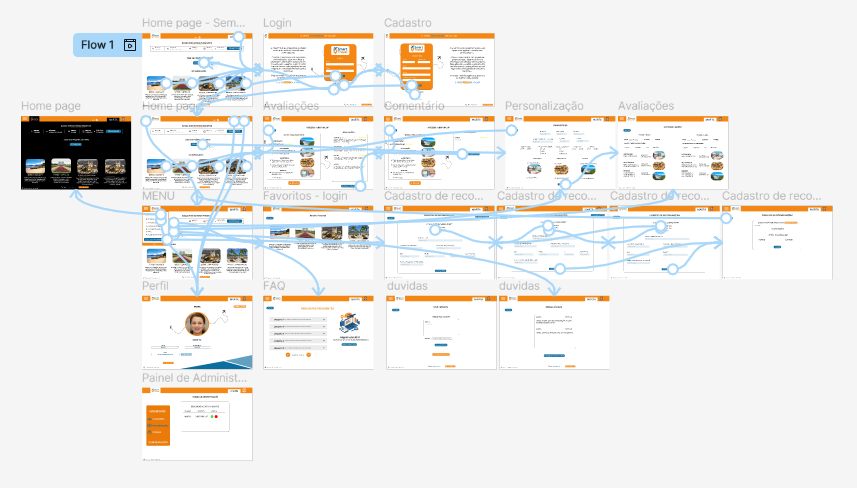

## Wireframes

### Home Page
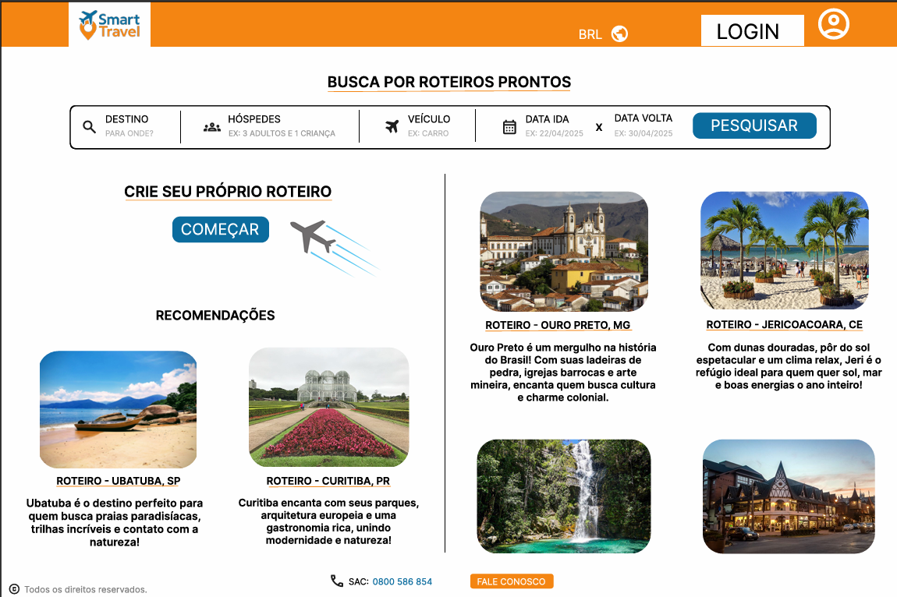
### Busca
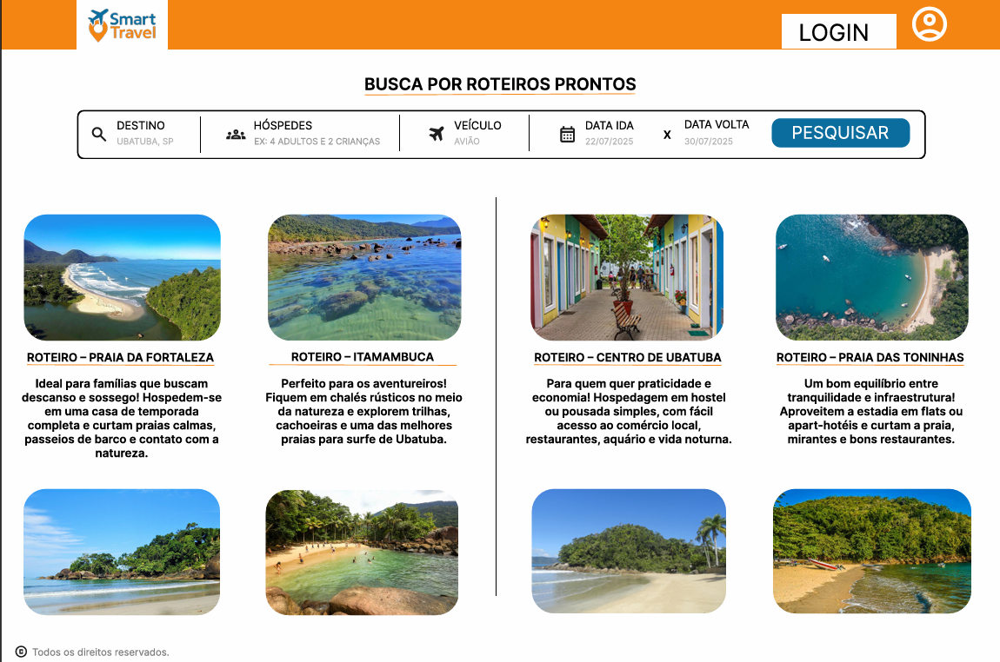
### Leitura roteiro
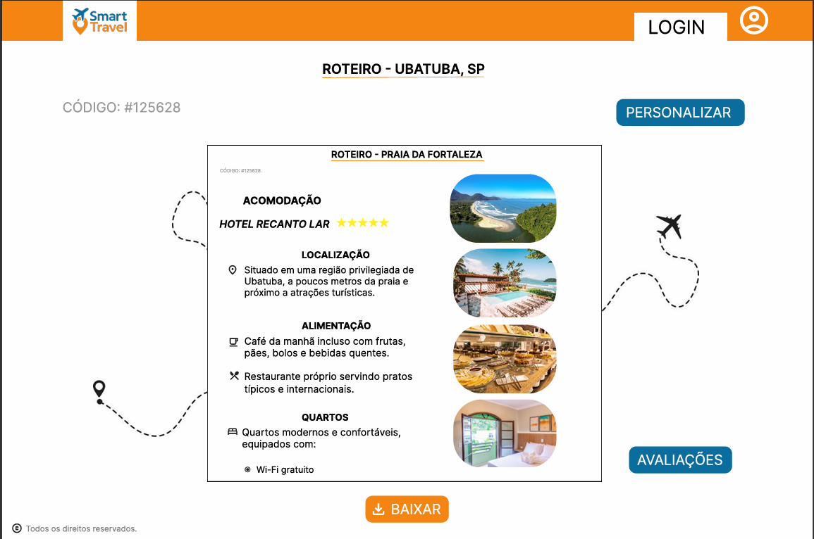
### Avaliações
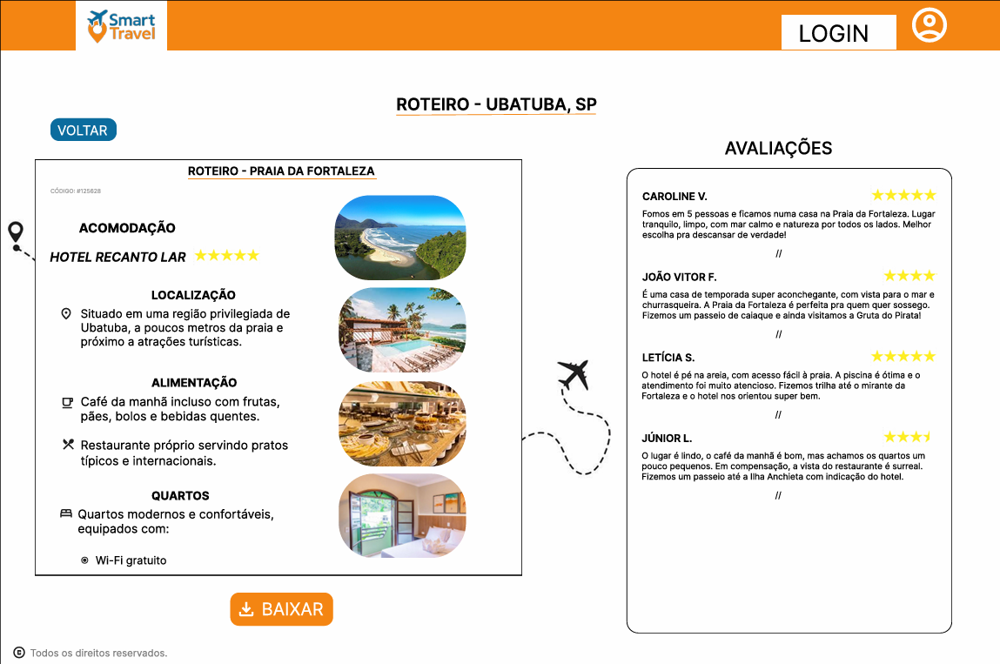
### Login
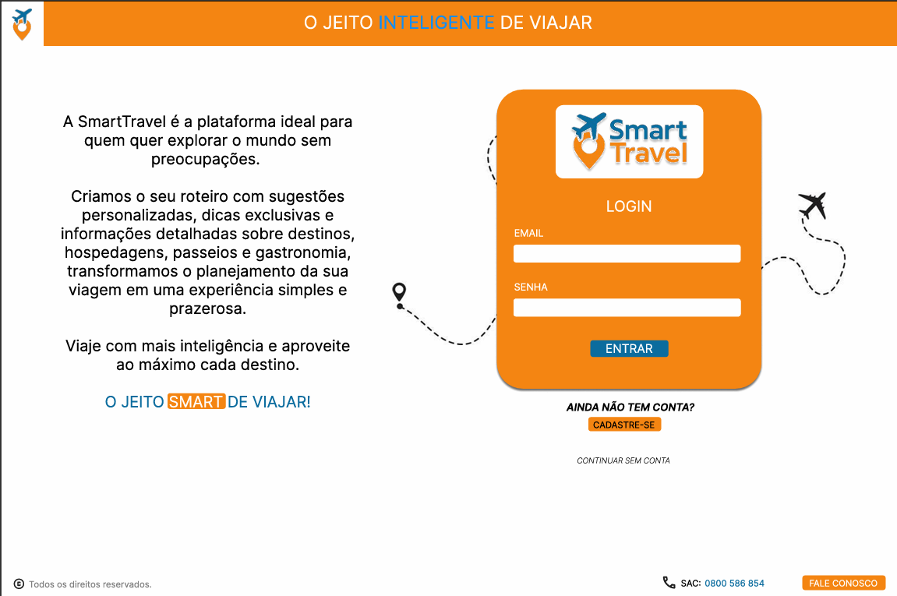
### Cadastro
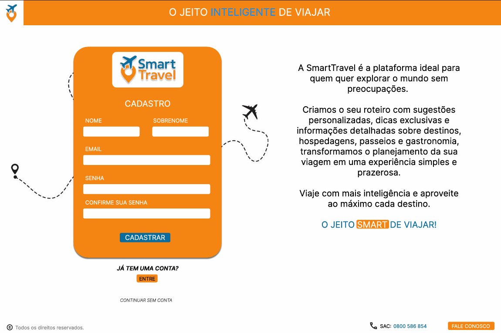
### Perfil
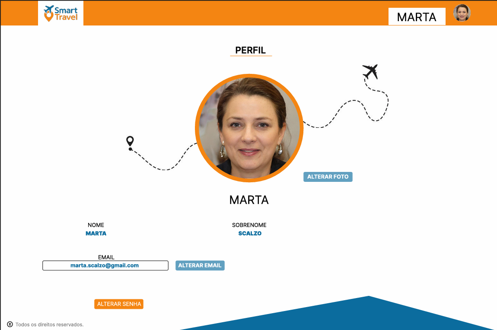
### Personalização
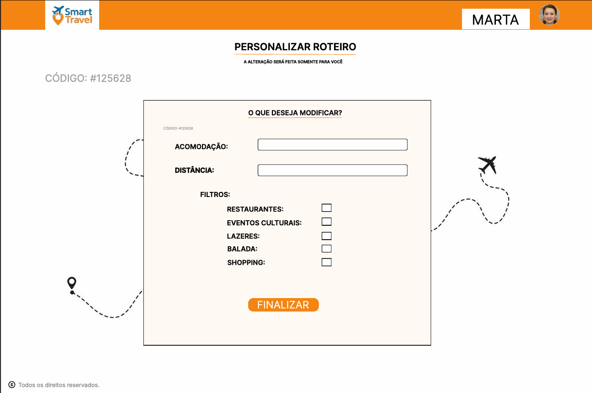
### Criação Roteiro
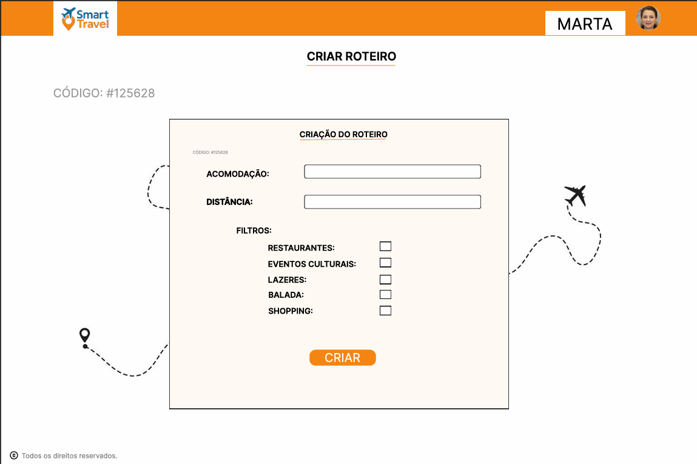
### Criação Roteiro 2
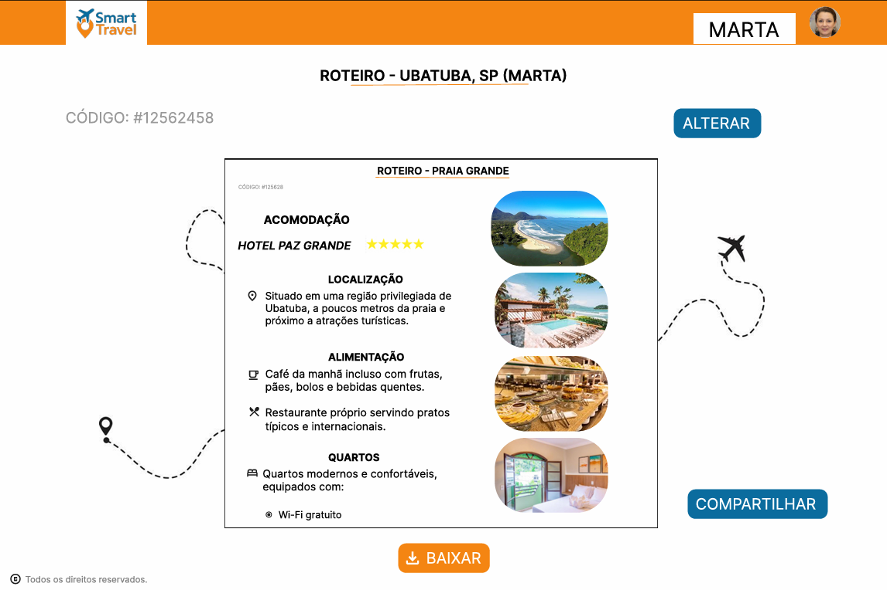

# Atividade feita > https://www.figma.com/design/IsuGRdMmtuFW54bjVKJ3cV/Smart-Travel?node-id=0-1&t=3srgTWUo7lG5HAUw-1
