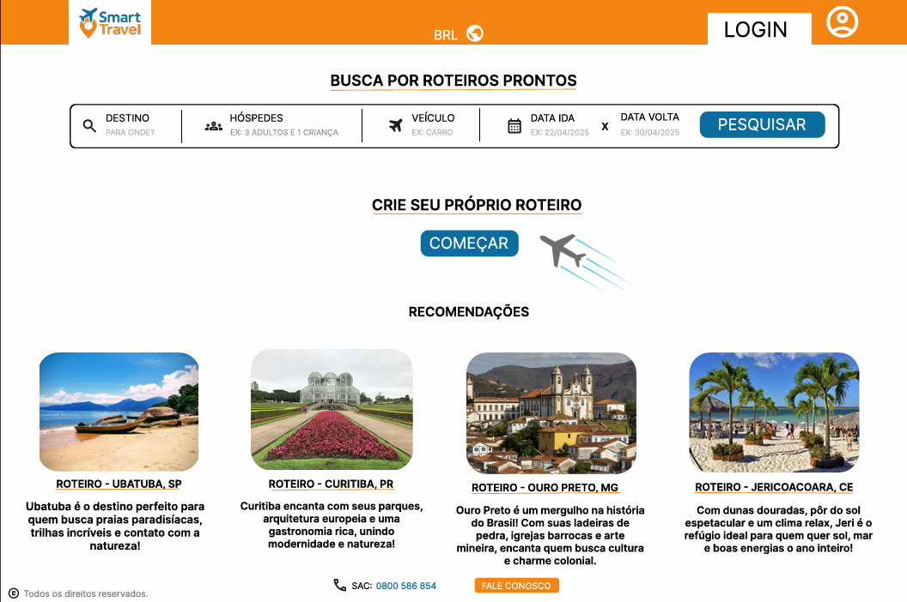
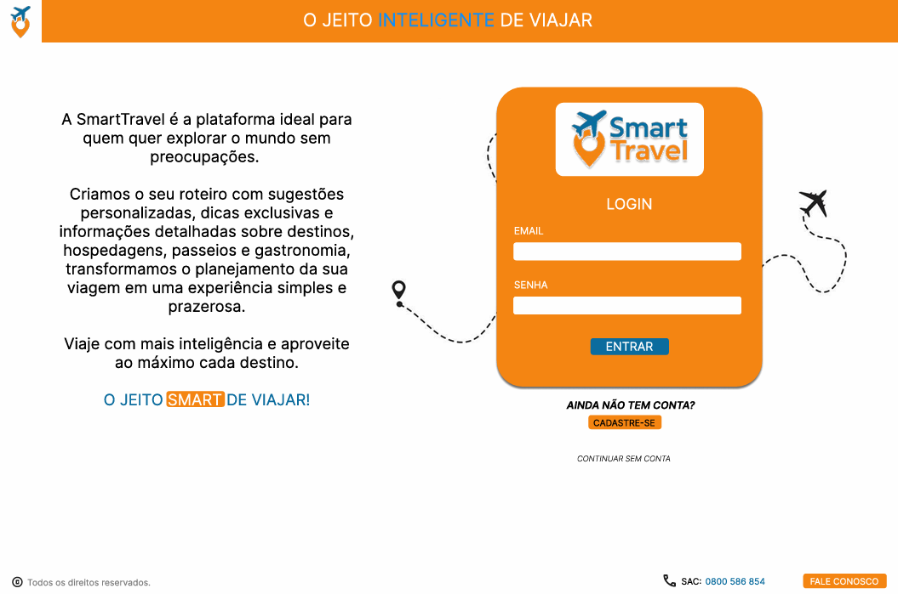
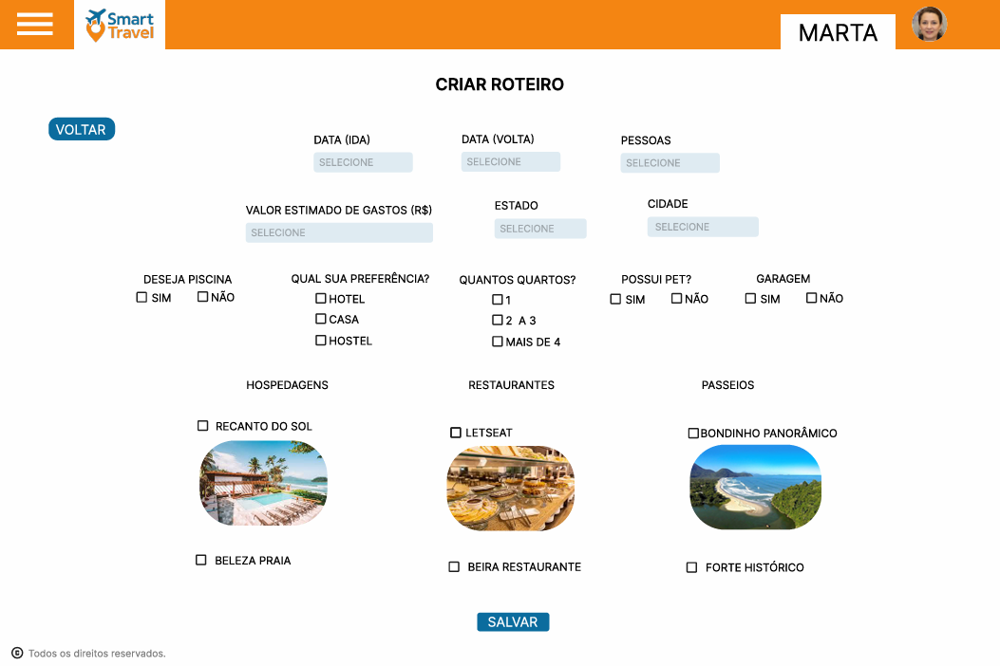
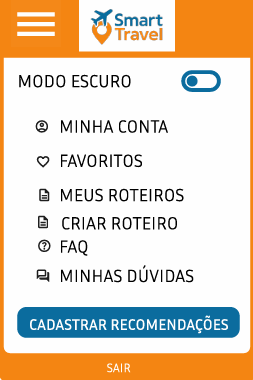

# Projeto da Solução

## Tecnologias Utilizadas 🖥️ 🔧

- **Linguagens**: HTML, CSS, JavaScript 
- **Frameworks**: Figma  
- **Programa Utilizado**: Visual Studio Code  
- **Versionamento de Código**: GitHub/git
- **Ambiente de Planejamento Kanban**: Trello + Monday

## Arquitetura da solução

# Interface do Sistema 🖥️

>Principais interfaces da plataforma<---------

## Tela principal do sistema

Pagina Inicial

## Tela de Login

Login/Cadastro de usuarios

## Tela da Criação de Roteiro

Pagina para criar roteiro personalizado

## Menu (redireção)

Menu Interativo para as demais paginas da plataforma

